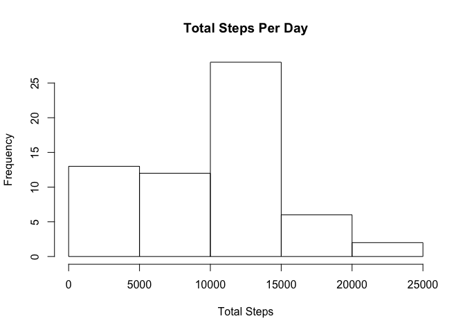
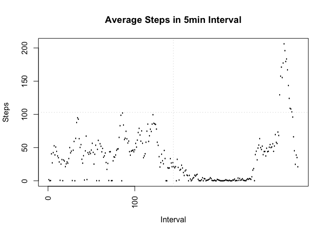
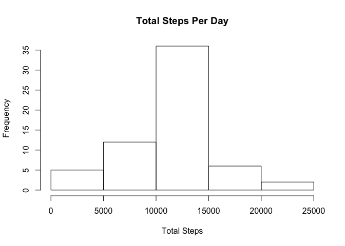
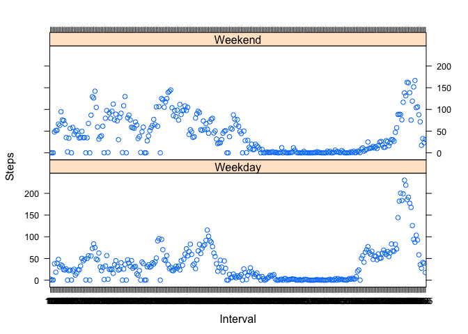

# Reproducible Research: Peer Assessment 1

## Loading and preprocessing the data

```r
activity_monitor = read.csv("activity.csv", header = TRUE)
```


## What is mean total number of steps taken per day?


```r
total_steps_daily = with(activity_monitor, tapply(steps,date,sum,na.rm=TRUE))
hist(total_steps_daily,main="Total Steps Per Day", xlab= "Total Steps", ylab="Frequency")
```



```r
total_steps_daily = with(activity_monitor, tapply(steps,date,sum,na.rm=TRUE))
mean_steps_daily = mean(total_steps_daily)
median_steps_daily = median(total_steps_daily)
```
### On an Average steps taken daily

```r
print(sprintf("Mean Total Steps per Day: %f", mean_steps_daily))
```

```
## [1] "Mean Total Steps per Day: 9354.229508"
```

```r
print(sprintf("Median Total Steps per Day: %f", median_steps_daily))
```

```
## [1] "Median Total Steps per Day: 10395.000000"
```
### Median Steps taken daily

```r
print(median_steps_daily)
```

```
## [1] 10395
```

## What is the average daily activity pattern?
### Find the interval mean

```r
int_mean = with(activity_monitor, tapply(steps, interval, mean, na.rm=TRUE))
```
### Copy the intervals to new vector

```r
x_label = as.factor(names(int_mean))

plot(x_label,int_mean, type="l",main= "Average Steps in 5min Interval", ylab="Steps", xlab="Interval",xaxt="n")

axis(1, at=seq(0,as.numeric(tail(x_label,n=1)),by=100),las=2)
grid(nx=length(seq(0,as.numeric(tail(x_label,n=1))+2,by=100)) )
```



###

## Imputing missing values

### missing row count

```r
print(nrow(activity_monitor) - sum(complete.cases(activity_monitor)))
```

```
## [1] 2304
```
### Imputing the N/A
#####activity_monitor = activity_monitor %>% group_by(interval) 
#####                    %>% mutate(steps = replace(steps, is.na(steps),
#####                                               mean(steps, na.rm=TRUE))) 

```r
library(dplyr)
```

```
## 
## Attaching package: 'dplyr'
```

```
## The following object is masked from 'package:stats':
## 
##     filter
```

```
## The following objects are masked from 'package:base':
## 
##     intersect, setdiff, setequal, union
```

```r
activity_monitor = mutate(group_by(activity_monitor, interval),
                          steps=replace(steps, is.na(steps),
                                        mean(steps,na.rm=TRUE)))

total_steps_daily_imp = with(activity_monitor, tapply(steps,date,sum,na.rm=TRUE))
hist(total_steps_daily_imp,main="Total Steps Per Day", xlab= "Total Steps", ylab="Frequency")
```



## Are there differences in activity patterns between weekdays and weekends?

```r
mean_steps_daily_imp = mean(total_steps_daily_imp)
median_steps_daily_imp = median(total_steps_daily_imp)
print(sprintf("Mean Total Steps per Day Imputed: %f", mean_steps_daily_imp))
```

```
## [1] "Mean Total Steps per Day Imputed: 10766.188679"
```

```r
print(sprintf("Median Total Steps per Day Imputed: %f", median_steps_daily_imp))
```

```
## [1] "Median Total Steps per Day Imputed: 10766.188679"
```
#### Both the Mean and Median Increased. It might be a special case but they both
#### are the same.

## Graphing for Weekday vs Weekend steps

```r
library(lattice)
activity_monitor$weekday = weekdays(as.Date(activity_monitor$date))
activity_monitor$weekday[activity_monitor$weekday == "Monday" 
                         | activity_monitor$weekday == "Tuesday"
                         | activity_monitor$weekday == "Wednesday"
                         | activity_monitor$weekday == "Thursday"
                         | activity_monitor$weekday == "Friday"] = "Weekday"

activity_monitor$weekday[activity_monitor$weekday == "Saturday" 
                         | activity_monitor$weekday == "Sunday"] = "Weekend"


weekday_interval_mean = with(subset(activity_monitor, weekday=="Weekday"),
                             tapply(steps, interval,mean))

weekend_interval_mean = with(subset(activity_monitor, weekday=="Weekend"),
                             tapply(steps, interval,mean))


interval_mean_graph = data.frame(weekday_interval_mean, names(weekday_interval_mean), weekday="Weekday",row.names = NULL)

names(interval_mean_graph) = c("Steps","Interval","weekday")

weekend_interval_mean = data.frame(weekend_interval_mean,names(weekend_interval_mean),weekday="Weekend",row.names=NULL)
names(weekend_interval_mean) = c("Steps","Interval","weekday")

interval_mean_graph = rbind(interval_mean_graph, weekend_interval_mean)

xyplot(Steps ~ Interval | weekday, layout=c(1,2), data=interval_mean_graph)
```




